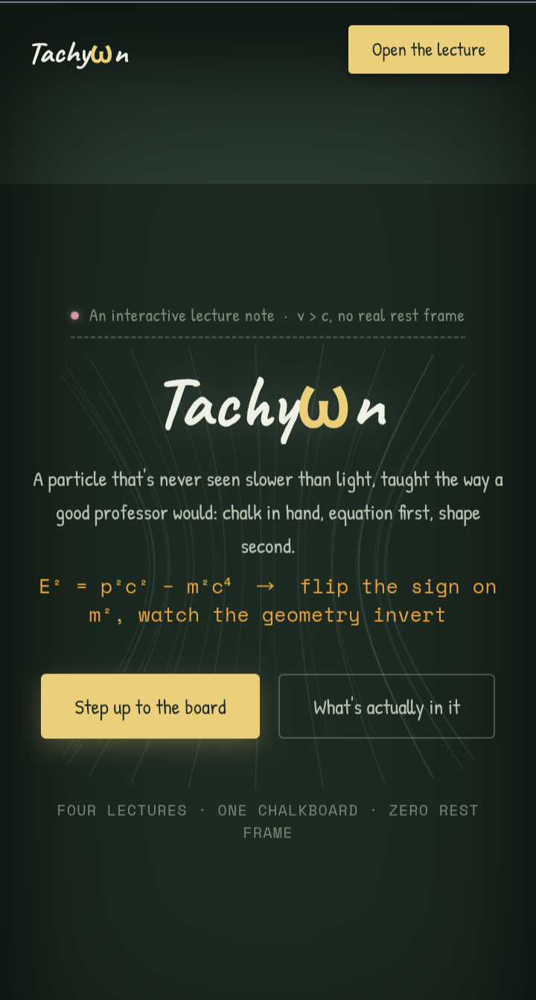

# Tachyωn

**An interactive lecture note on a faster-than-light particle — taught the way a good professor would: chalk in hand, equation first, shape second.**

🔗 **Live demo:** [nazat02.github.io/Tachyon](https://nazat02.github.io/Tachyon/)



---

## What this is

Special relativity doesn't technically *forbid* particles that travel faster than light — it just makes their mass imaginary and erases their rest frame. **Tachyon** takes that one algebraic sign flip in the energy–momentum relation,

```
E² = p²c² − m²c⁴
```

and turns it into four explorable, real-time 3D visualizations, each one a different physical consequence of the same broken sign. It's built as a single chalkboard-styled web app — no backend, no build step, no login — designed to be projected in a classroom or explored solo in a browser tab.

The whole site is two static HTML files:

| File | Purpose |
|---|---|
| `index.html` | Landing page — explains the physics, previews all four modes, links to the simulation |
| `simulation.html` | The actual interactive 3D lecture, built with [Three.js](https://threejs.org/) |

There is no framework, no package manager, and no build process. Open the files directly or serve them statically.

---

## The four lectures

Each mode is rendered as a live, rotatable 3D scene driven by a single slider (tachyonic mass², `m² < 0`) and a tab switcher — drag one, tap the other.

### 01 · Energy–momentum hyperboloid
`E² = p²c² − m²c⁴`

Flip the sign on `m²` and the two-sheeted hyperboloid of an ordinary (massive) particle opens into one continuous surface with a throat at `|p| = √(−m²)`. There is no point on this surface where the particle is at rest — every kinematically allowed state has `E ≥ |p|c`.

### 02 · Light cone
`Δx > cΔt`

A tachyon's worldline runs *outside* the light cone, connecting two events that no slower-than-light signal could ever link. Different inertial observers disagree about which event happens first — the seed of the famous tachyonic-antitelephone causality paradox.

### 03 · Imaginary mass
`m = iμ,  μ ∈ ℝ`

Writing `m² = −μ²` makes the rest mass itself imaginary. Below the momentum threshold `|p| = μ`, the real-valued energy–momentum relation has no real solution at all — the surface visibly dips into a forbidden region with no physical particle on it.

### 04 · Cherenkov shock
`cos θ_c = c / v`

A charged tachyon can't avoid radiating: it sheds vacuum Cherenkov photons into a forward shock cone. Losing energy through this radiation makes it *speed up* further — a runaway process with no terminal velocity, the mirror image of ordinary (slower-than-light) Cherenkov radiation.

---

## Features

- **Four interactive 3D modes** rendered with Three.js (r128), each its own self-contained "lecture"
- **One live slider** (`m²`, range −3 to −0.1) that deforms the active geometry in real time, with synced numeric readouts
- **Manual orbit camera** — drag to rotate, pinch or scroll to zoom, no external orbit-controls dependency
- **Live readings plate** — mass², energy ratio (`E/mc²`), speed (`v/c`), and frame rate, styled as a taped index card; collapses to a docked tab on mobile so it never blocks the view
- **Hand-set chalkboard aesthetic** — custom CSS using Google Fonts (`Caveat`, `Patrick Hand`, `Space Mono`) over a textured chalkboard surface, with chalk-dust dividers between landing-page sections
- **Fully responsive** — bottom controls stack into a single column on phones; touch gestures supported throughout
- **Respects `prefers-reduced-motion`** — animations and auto-rotation are disabled for users who request it
- **Zero dependencies beyond Three.js** — no React, no bundler, no Node toolchain; the only external script is loaded from a CDN
- **Zero backend** — runs entirely client-side; no logins, accounts, or data collection

---

## Running it locally

Because the app loads Google Fonts and Three.js from a CDN but otherwise needs no server-side logic, you have two options:

**Option 1 — just open the file**
```bash
open index.html        # macOS
# or double-click index.html in your file explorer
```

**Option 2 — serve it statically** (recommended, avoids any `file://` CORS quirks)
```bash
git clone https://github.com/nazat02/Tachyon.git
cd Tachyon
python3 -m http.server 8000
# then visit http://localhost:8000
```

No installation, build step, or environment variables are required.

---

## Tech stack

| Layer | Choice |
|---|---|
| 3D rendering | [Three.js r128](https://threejs.org/) (loaded via cdnjs) |
| Markup/styling | Hand-written semantic HTML + CSS (custom properties, no framework) |
| Fonts | Google Fonts — `Caveat`, `Patrick Hand`, `Space Mono` |
| Camera controls | Custom pointer/touch-event orbit + pinch-zoom (no `OrbitControls` dependency) |
| Hosting | GitHub Pages |

---

## Project structure

```
Tachyon/
├── index.html        # Landing page: physics primer, mode previews, FAQ, CTA
├── simulation.html    # The interactive 3D lecture (all 4 modes)
├── preview.png         # Social/README preview image
└── LICENSE             # MIT
```

---

## Physics references

- Feinberg, G. *"Possibility of Faster-Than-Light Particles."* Physical Review, 1967.
- Recami, E. *"Classical Tachyons and Possible Applications."* Rivista del Nuovo Cimento, 1986.

**A note on the physics:** tachyons are not a confirmed particle — no experiment to date has found one. They're a mathematically legal solution to the relativistic energy–momentum equation, useful for stress-testing what "forbidden by relativity" actually means, not a claim about something detected in nature. This project visualizes the math honestly, as a teaching tool rather than a speculative-physics claim.

---

## License

Released under the [MIT License](LICENSE).

Copyright © 2026 Md. Shaikhul Hadis Nazat
